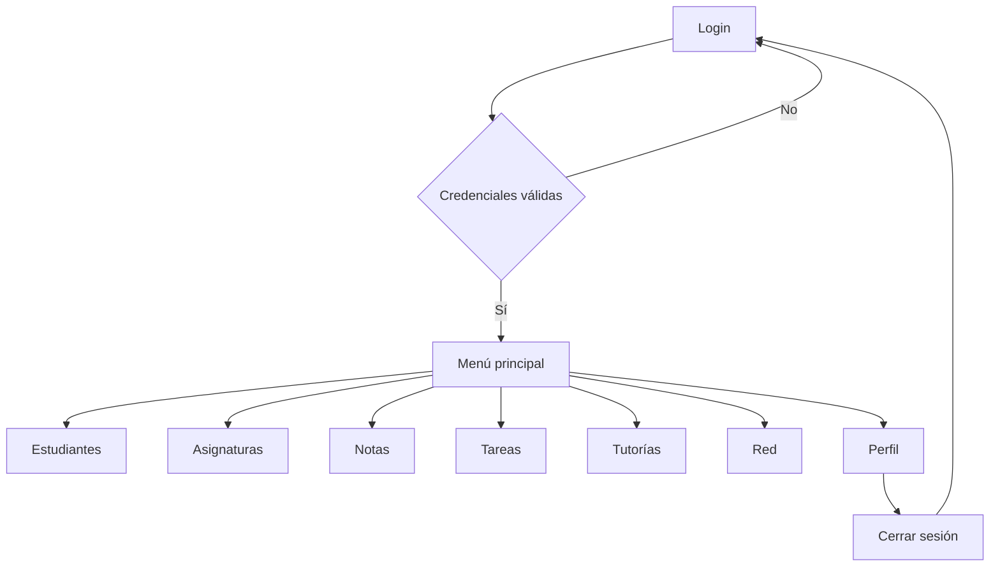
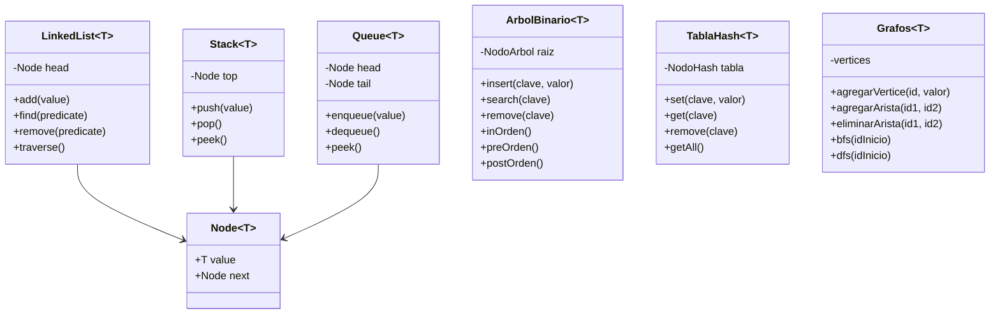
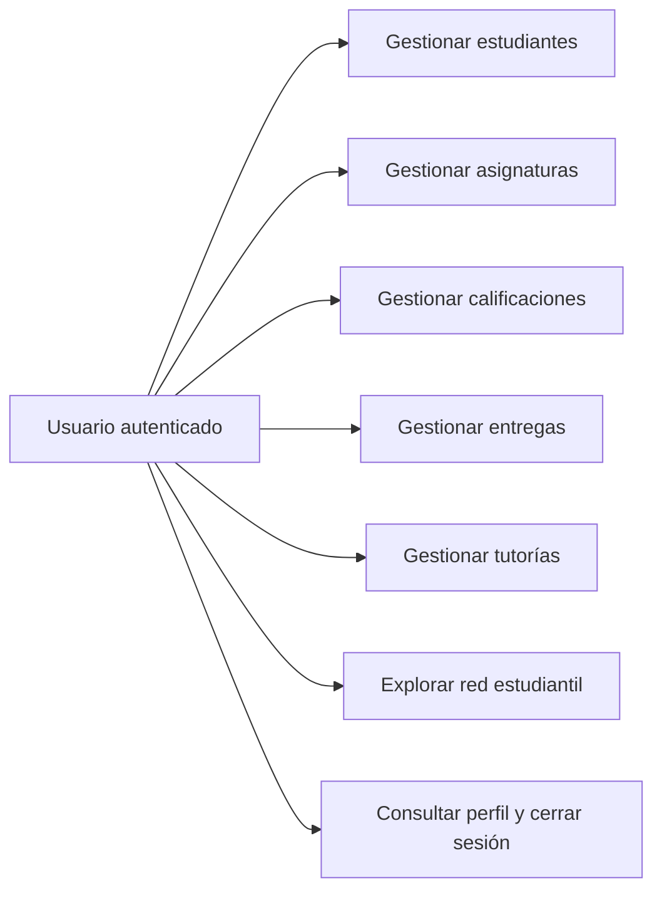

# Plataforma Educativa
## Documento técnico del proyecto de clase

**Curso:** Estructuras de Datos  
**Tecnología:** React Native, TypeScript y Expo SDK 57  
**Persistencia:** Supabase  
**Fecha:** 2026

---

## 1. Introducción

Este proyecto implementa una plataforma educativa para gestionar información académica. La aplicación integra autenticación, registro de estudiantes, asignaturas, calificaciones, entregas, tutorías y relaciones de colaboración.

El objetivo principal es demostrar que las estructuras de datos no son solamente ejercicios aislados, sino herramientas aplicables a problemas reales de una institución educativa.

## 2. Descripción del problema

Un docente o administrador académico necesita organizar estudiantes, materias, notas, tareas y solicitudes de tutoría. Si toda la información se maneja manualmente, buscar registros, ordenar solicitudes y analizar relaciones puede ser lento y propenso a errores.

La solución propuesta centraliza estas operaciones en una aplicación móvil con una interfaz sencilla, persistencia en Supabase y una estructura de datos adecuada para cada necesidad.

## 3. Objetivos

### Objetivo general

Diseñar una aplicación móvil educativa que gestione operaciones académicas mediante listas enlazadas, pilas, colas, árboles binarios, tablas hash y grafos.

### Objetivos específicos

- Registrar y consultar estudiantes.
- Administrar asignaturas y calificaciones.
- Procesar entregas y solicitudes de tutoría.
- Representar relaciones de colaboración estudiantil.
- Persistir información en Supabase.
- Presentar operaciones visibles de cada estructura.

## 4. Justificación de las estructuras

| Módulo | Estructura | Justificación |
|---|---|---|
| Estudiantes | Tabla hash | El ID es una clave única y permite búsqueda directa, inserción y eliminación. Se manejan colisiones mediante nodos enlazados. |
| Asignaturas | Lista enlazada | Las materias forman una colección dinámica que se puede recorrer, buscar, insertar y eliminar. |
| Notas | Árbol binario | Las notas se organizan por comparación numérica y permiten búsqueda y recorridos inorden, preorden y postorden. |
| Tareas | Pila | Las entregas se procesan con comportamiento LIFO: la última entrega agregada es la primera que se procesa. |
| Tutorías | Cola | Las solicitudes se atienden con comportamiento FIFO: la primera solicitud recibida se atiende primero. |
| Red | Grafo | Los estudiantes son vértices y sus relaciones son conexiones. La red permite lista de adyacencia, recorrido por niveles y recorrido en profundidad. |

## 5. Arquitectura

La aplicación se divide en:

- `src/screens`: pantallas y flujos de usuario.
- `src/structures`: implementaciones manuales de las estructuras.
- `src/models`: clases de dominio.
- `src/context`: estado compartido y estructuras activas.
- `src/navigation`: menú principal.
- `src/lib`: cliente Supabase.
- `supabase`: esquema y políticas de seguridad.

La aplicación conserva las estructuras manuales para demostrar su funcionamiento y usa Supabase como persistencia remota.

## 6. Flujo principal



## 7. Diagramas UML

### Diagrama de clases de estructuras



### Diagrama de casos de uso



## 8. Base de datos

Supabase contiene las tablas:

- `estudiantes`
- `asignaturas`
- `calificaciones`
- `tareas`
- `tutorias`
- `conexiones_estudiantes`

Las tablas tienen Row Level Security y políticas para usuarios autenticados. El esquema completo está en `supabase/schema.sql`.

## 9. Capturas del sistema

Insertar en esta sección capturas tomadas durante el demo:

1. Pantalla de login.
2. Menú principal con iconos.
3. Registro y búsqueda de estudiantes.
4. Registro de asignaturas.
5. Recorridos y eliminación de notas.
6. Pila de entregas.
7. Cola de tutorías.
8. Red con conexiones y recorridos.
9. Perfil y cierre de sesión.

> Las capturas deben tomarse en un dispositivo o emulador para mostrar el resultado real de la interfaz.

## 10. Lean Canvas

| Bloque | Contenido |
|---|---|
| Problema | Gestión dispersa de estudiantes, notas, tareas y solicitudes de tutoría. |
| Segmentos | Docentes, coordinadores y administradores académicos. |
| Propuesta de valor | Una plataforma móvil sencilla que centraliza operaciones académicas y demuestra estructuras de datos. |
| Solución | Módulos de estudiantes, asignaturas, notas, tareas, tutorías y red colaborativa. |
| Canales | Aplicación móvil, demostración de clase y distribución mediante Expo o APK. |
| Fuentes de ingreso | Proyecto académico; potencialmente licencia institucional o servicio educativo. |
| Estructura de costos | Desarrollo, mantenimiento, Supabase y distribución móvil. |
| Métricas clave | Usuarios autenticados, registros creados, solicitudes atendidas y conexiones estudiantiles. |
| Ventaja diferencial | Uso visible y justificado de seis estructuras de datos manuales. |

## 11. Manejo de errores y seguridad

La aplicación valida campos obligatorios, rangos numéricos, relaciones inválidas, credenciales y respuestas de Supabase. El cliente utiliza únicamente la clave pública de Supabase. Las políticas RLS protegen las tablas para usuarios autenticados.

## 12. Conclusiones

La plataforma demuestra una aplicación práctica de estructuras de datos en un contexto educativo. Cada estructura se utiliza en una función concreta y visible, mientras Supabase permite conservar la información y autenticar usuarios.

El proyecto puede ampliarse con roles de docente y estudiante, permisos diferenciados, notificaciones y reportes académicos.

## 13. Referencias de ejecución

```bash
npm install
npx tsc --noEmit
npx expo start -c
```
